# Lab 2 – Model comparison using Researcher Critique and Council models

*Estimated Duration: 60 minutes*

## Lab Overview

The Researcher agent in Microsoft Copilot can run on three different
model configurations: Critique, Model Council, and Claude. Each combines
models from OpenAI and Anthropic differently, and each is likely to
produce a different kind of research output — in depth, source handling,
and how it deals with conflicting information.

This lab does not tell you which model is best. Instead, you will run
the same research brief through all three model configurations, evaluate
the outputs yourself against a consistent set of criteria, and record
your own recommendation. Exercise 1 uses a retail brief; Exercise 2 uses
a healthcare brief — two domains where research quality, sourcing, and
handling uncertainty matter for genuinely different reasons.

## Learning Objectives

After completing this lab, you will be able to:

- Locate and use the model selector inside the Researcher agent.

- Run an identical research brief through Critique, Model Council, and
  Claude.

- Evaluate research output against consistent criteria: source quality
  and diversity, reasoning depth, handling of conflicting or uncertain
  information, and speed.

- Form and justify your own model recommendation for a retail research
  scenario.

- Form and justify your own model recommendation for a healthcare
  research scenario.

- Explain, in your own words, why the best model can differ by domain or
  by task.

## Model Reference

These are the three model configurations you will compare in this lab.
Read the descriptions before you begin — you will decide for yourself
which one fits each scenario.

[TABLE]

**Note:** the model selector also offers Auto (“best model for the
task”). This lab deliberately excludes Auto — the point of the exercise
is to compare the three named configurations directly, not to see what
automatic routing picks.

## Lab Prerequisites

- A Microsoft Copilot license assigned to your user account, with
  access to the Researcher agent.

- A work or school account in a Microsoft 365 tenant with Copilot
  enabled.

- Permission for your tenant to use the Critique, Model Council, and
  Claude model options within Researcher (confirmed by your Microsoft
  365 administrator).

- A supported browser: the latest version of Microsoft Edge or Google
  Chrome.

## Lab Environment

- Tenant: A Microsoft 365 tenant with Copilot enabled and the Researcher
  agent's Critique, Model Council, and Claude model options switched on
  in the admin center.

- User account: A licensed Copilot user with access to the Researcher
  agent.

- Permissions: Standard user permissions; no admin role is required to
  complete the learner's steps.

- Required resources: Microsoft Copilot Researcher agent only.

## Exercise 1 — Retail: Which Model Research a Market Entry Question Best?

Objective: Run the same retail research brief through Critique, Model
Council, and Claude, then decide for yourself — using evidence from the
outputs — which model you would use for this kind of retail research
question in future.

### Task 1 — Run the Brief with Critique

1.  Navigate to
    +++[https://copilot.microsoft.com+](https://copilot.microsoft.com/)++
    and log in with your credentials.
    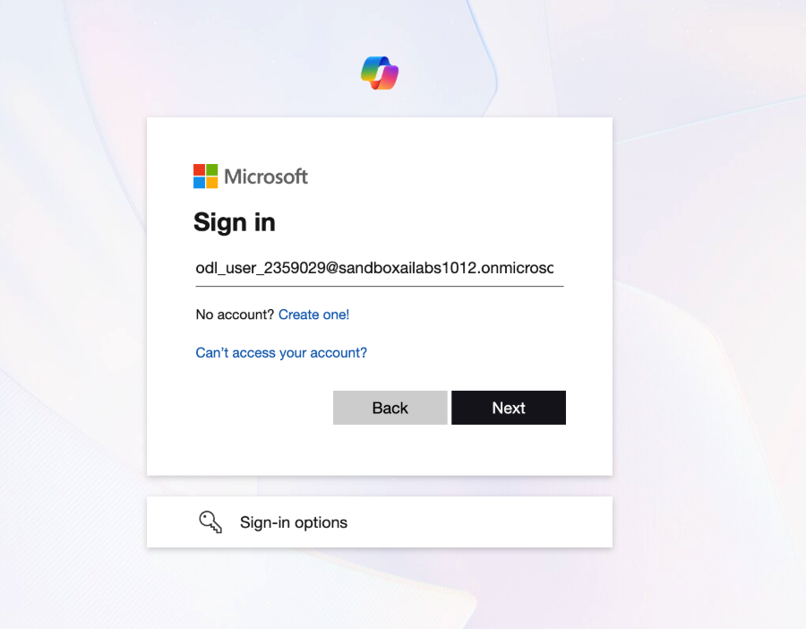

2.  Enter your password.  
    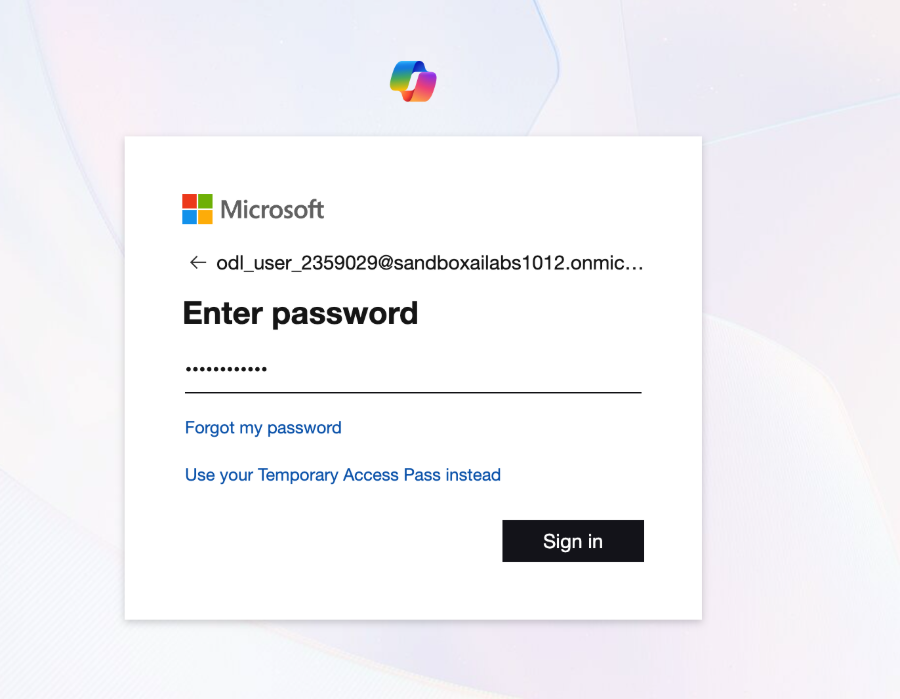

3.  Select Researcher agent from the left navigation bar.  
    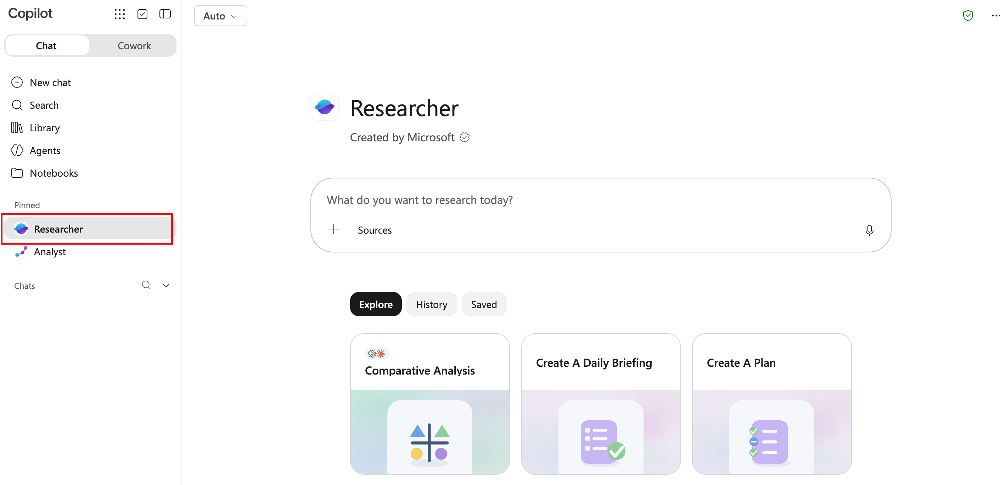

4.  Select the model selector (top left, showing the current model) and
    choose Critique.  
    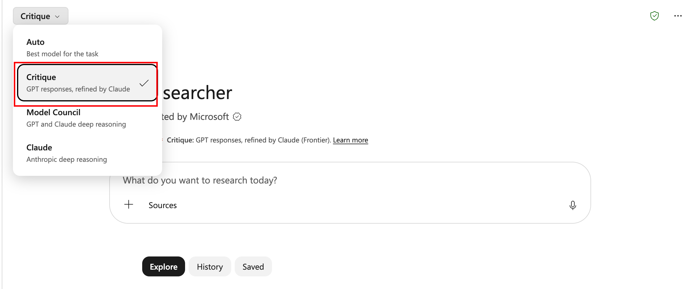

5.  Paste the research brief below into the What do you want to research
    today? box and submit it:

*“Research the competitive landscape for premium athletic footwear
brands launching a direct-to-consumer subscription model in North
America. Cover current subscription offerings from major and challenger
brands, customer demand signals, pricing approaches, and the biggest
risks to a new entrant. Cite your sources.”*  
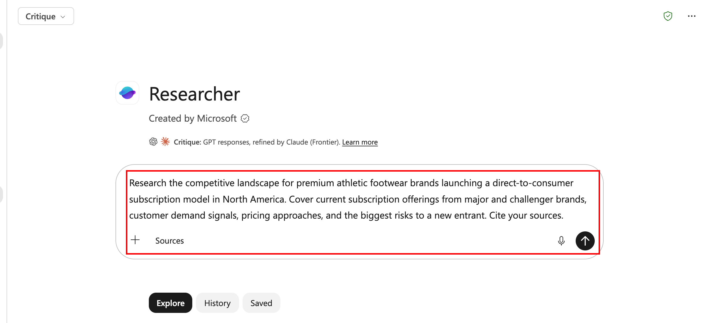

6.  Expected result: A research output with cited sources. Note how many
    sources it draws, how it's structured, and how long it takes.  
    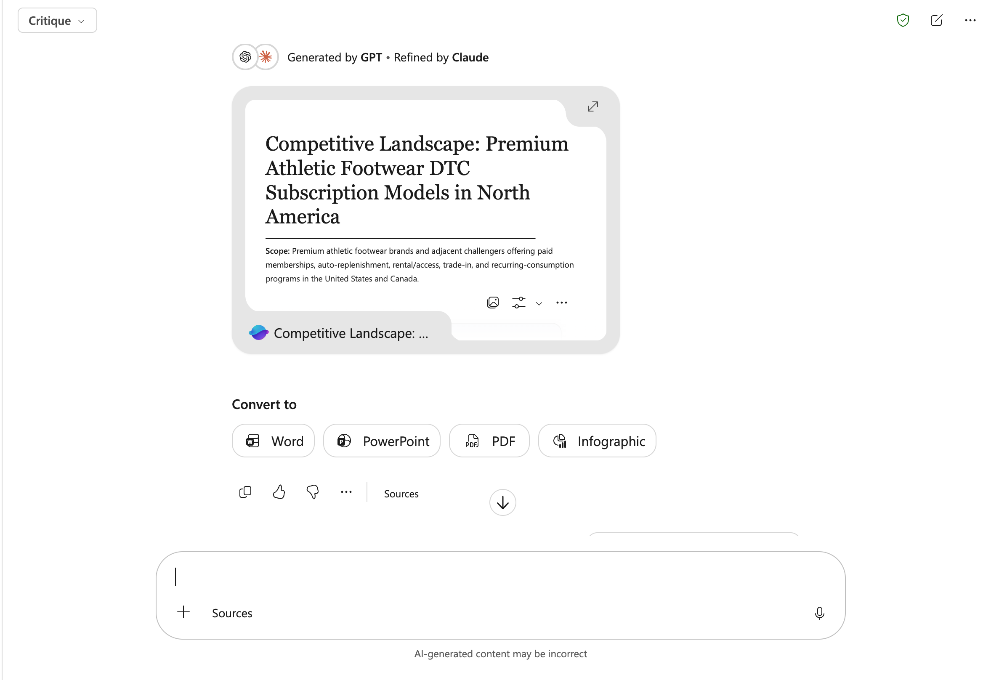

### Task 2 — Run the Same Brief with Model Council

1.  Start a new research session, then select the model selector and
    choose Model Council.  
    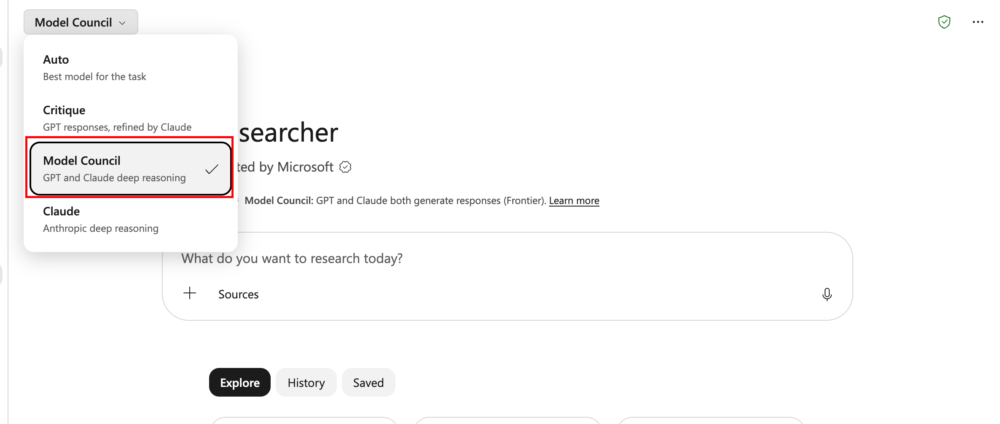

2.  Submit the identical brief used in Task 1.  
    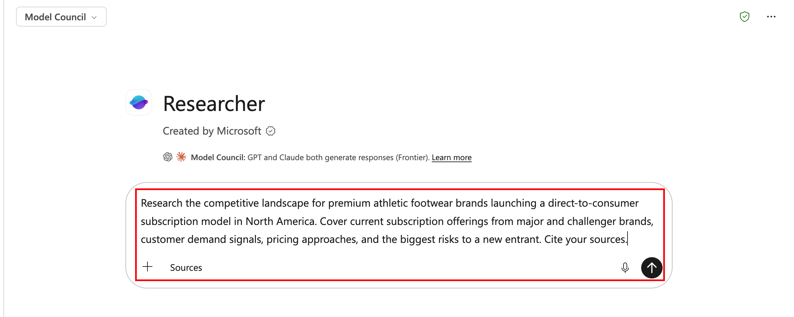

3.  Note the generation of time and whether the output reads as a single
    reconciled view or shows signs of multiple perspectives being
    weighed against each other.  
    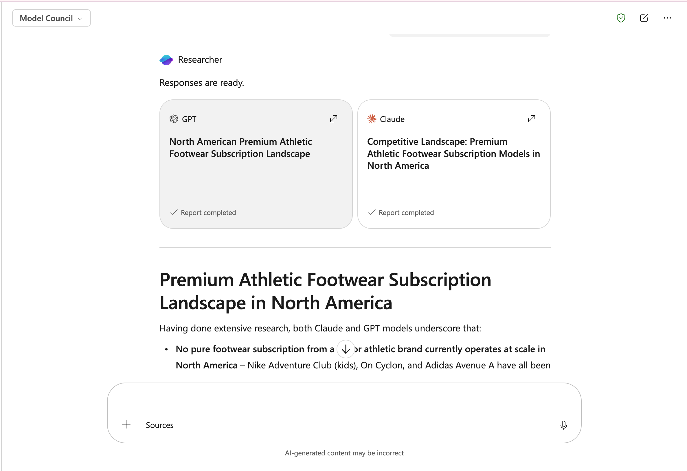

### Task 3 — Run the Same Brief with Claude

1.  Start a new research session, then select the model selector and
    choose Claude.  
    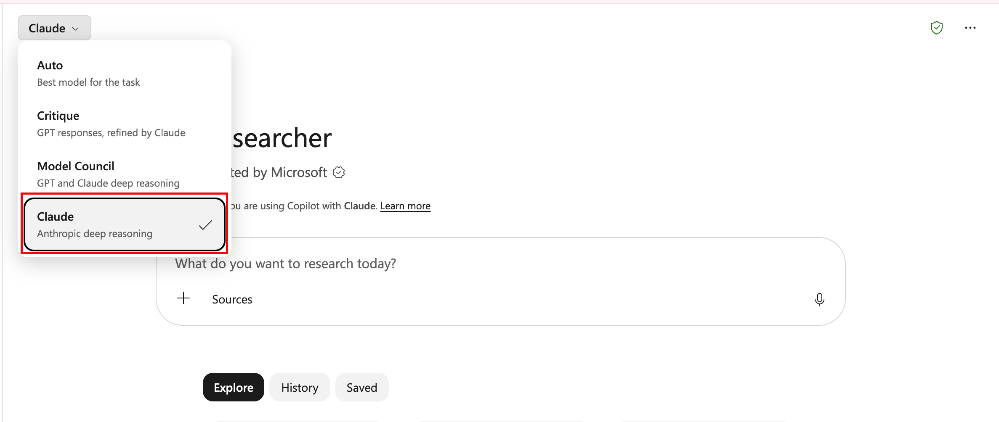

2.  Submit the identical brief used in Task 1.  
    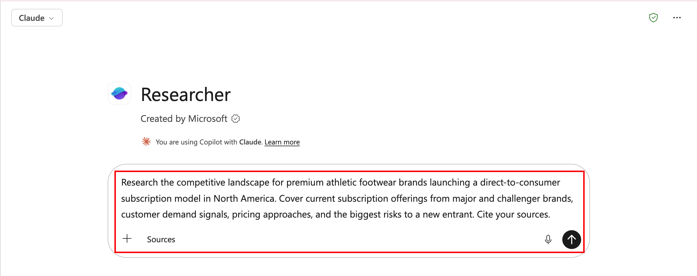

3.  Read all three outputs side by side. Pay attention to: source
    quality and diversity, how each model handles claims that different
    sources disagree on, structure and readiness to hand to a
    stakeholder, and generation speed.  
    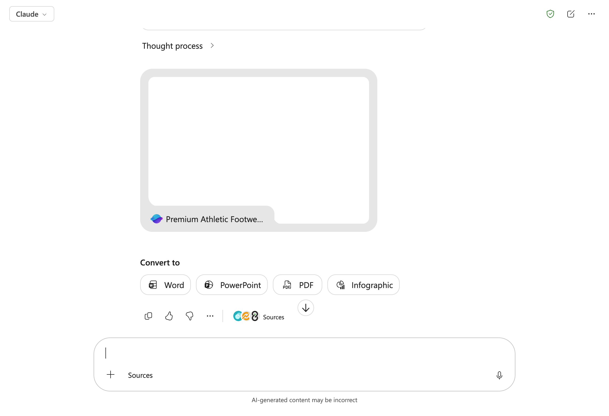

### Validation

- You produced three research outputs to the identical retail brief —
  Critique, Model Council, and Claude — each from a new session.

- You can describe, in one sentence per model, what stood out about its
  sourcing and its handling of the competitive question.

- You completed the worksheet below with your own observations and
  picked a recommended model, with a reason.

***Your Comparison — Retail Market-Entry Research***

Fill in each cell with what you actually observed and compare with the
pre-filled answers in the table below. There is no single correct answer
— the goal is a comparison you can defend.

[TABLE]

## Exercise 2 — Healthcare: Which Model Research a Clinical Technology Question Best?

Objective: Run the same healthcare research brief through Critique,
Model Council, and Claude, then decide for yourself which model you
would use for this kind of healthcare research question — where sourcing
rigor and careful handling of uncertainty matter even more than in
Exercise 1.

### Task 1 — Run the Brief with Critique

1.  Start a new research session in the Researcher agent.

2.  Select the model selector and choose Critique.  
    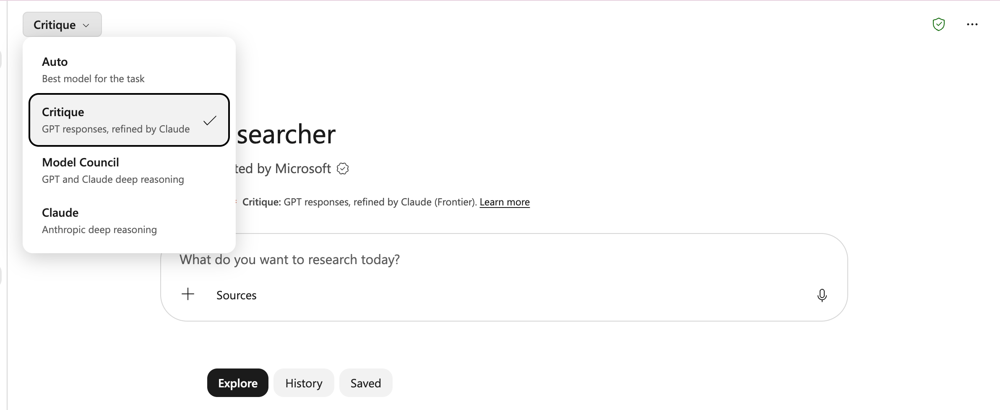

3.  Paste the research brief below into the What do you want to research
    today? box and submit it.

*“Research the current state of non-invasive continuous glucose
monitoring (CGM) technology for people without the leading approaches in
development, the evidence for their accuracy compared with invasive CGM,
and the regulatory status in the US and EU. Be explicit about where the
evidence is still limited or preliminary. Cite your sources.”*  
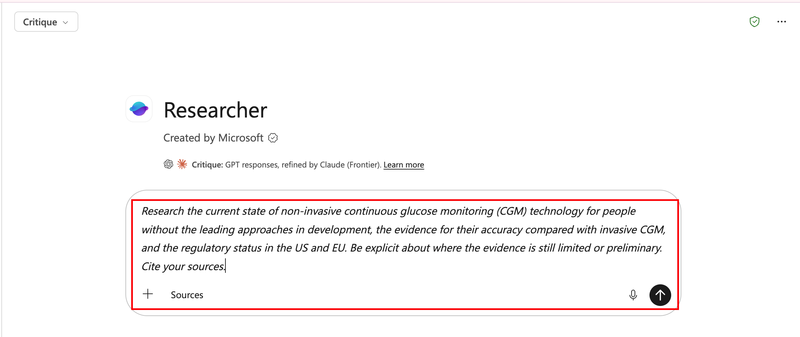

4.  **Expected result:** A research output with cited sources. Note
    whether — and how clearly — it flags evidence that is preliminary or
    unsettled, rather than presenting everything with the same
    confidence.  
    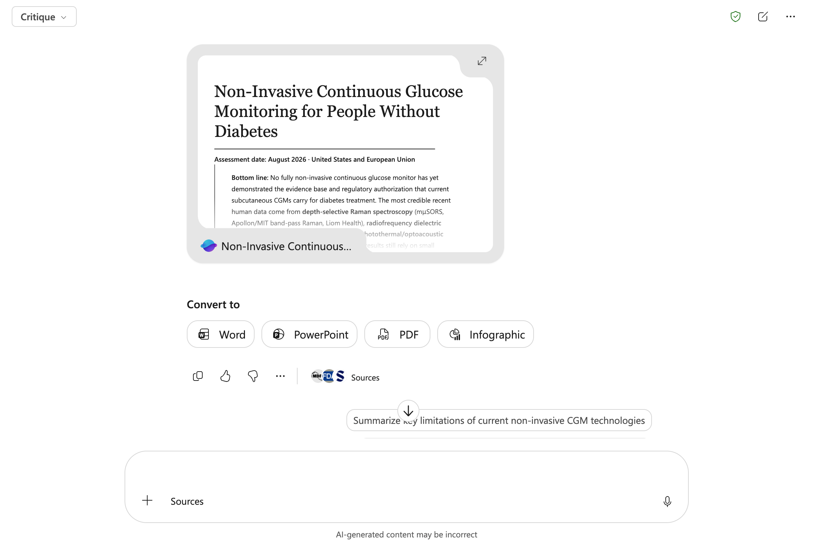

### Task 2 — Run the Same Brief with Model Council

1.  Start a new research session, then select the model selector and
    choose Model Council.  
    

2.  Submit the identical brief used in Task 1.  
    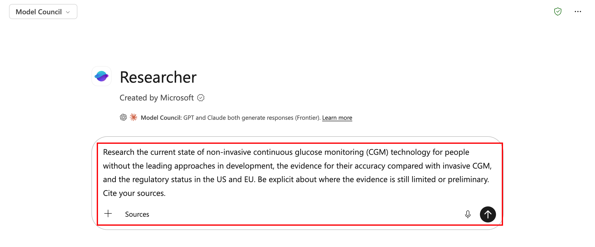

3.  Note the generation time and whether reconciling multiple models
    produces a more cautious or a more confident-sounding answer than
    Task 1.  
    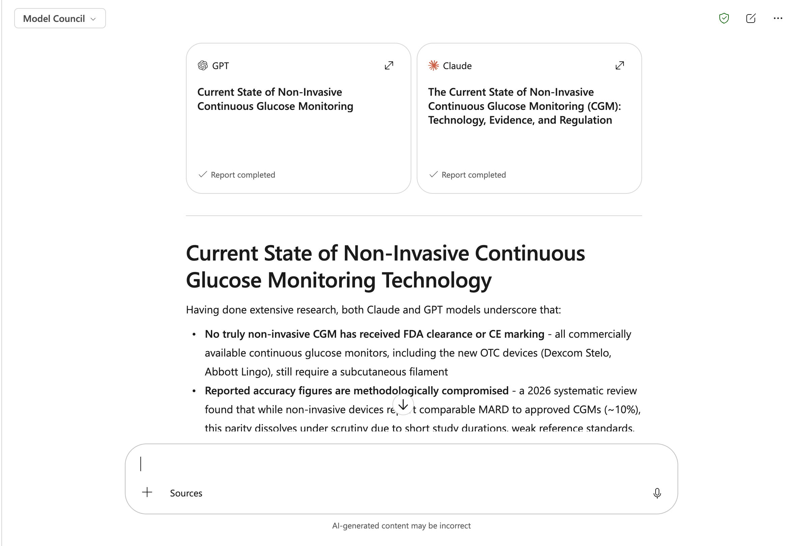

### Task 3 — Run the Same Brief with Claude

1.  Start a new research session, then select the model selector and
    choose Claude.  
    

2.  Submit the identical brief used in Task 1.  
    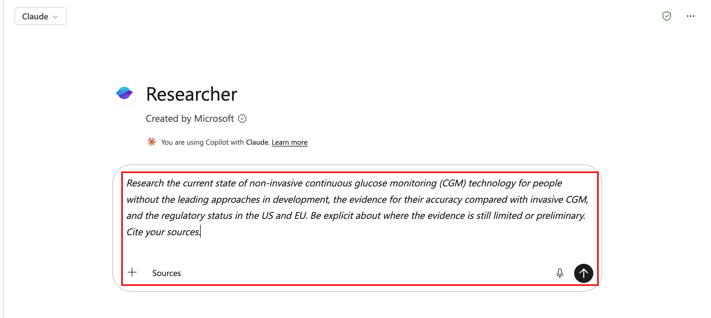

3.  Read all three outputs side by side. Pay particular attention to:
    how each model distinguishes established evidence from preliminary
    or contested findings, source quality (peer-reviewed and regulatory
    sources versus general web content), regulatory accuracy, and
    whether you would be comfortable sharing the output with a clinician
    without further verification.  
    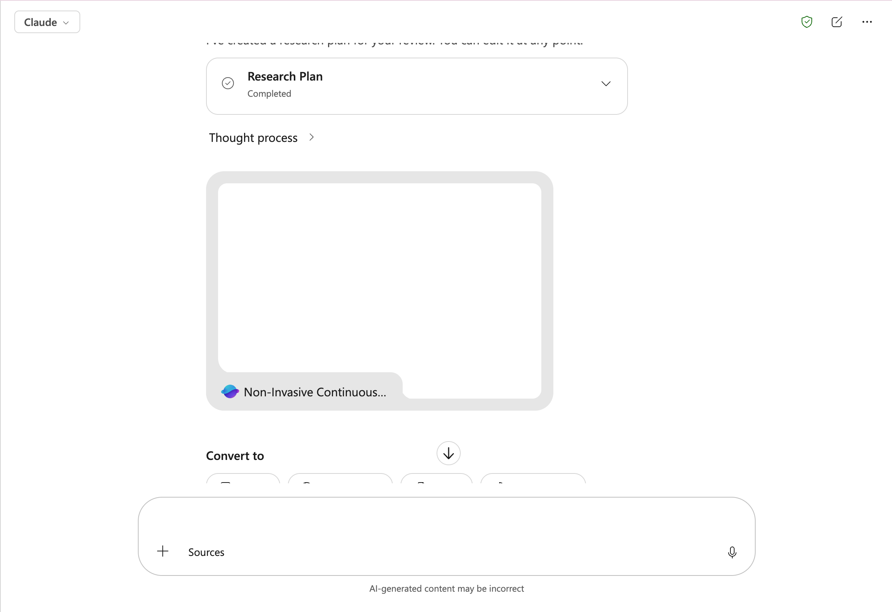

**Validation**

- You produced three research outputs to the identical healthcare brief
  — Critique, Model Council, and Claude — each from a new session.

- You can describe, in one sentence per model, how it handled the
  distinction between established and preliminary evidence.

- You completed the worksheet below with your own observations and
  picked a recommended model, with a reason.

- You can state, in one sentence, whether your healthcare recommendation
  matches your retail recommendation from Exercise 1 — and if not, why
  the domain changed your answer.

### Your Comparison — Healthcare Technology Research

Fill in each cell with what you actually observed. There is no single
correct answer — the goal is a comparison you can defend.

[TABLE]

## Lab Summary

You ran the same research brief through Critique, Model Council, and
Claude twice — once for a retail market-entry question, once for a
healthcare technology question — and built your own evidence-based
recommendation each time, rather than being handed one. The skill this
lab is building isn't “which model is best” — it's recognizing that the
answer depends on the domain and the stakes: a research task where
getting the competitive picture roughly right is enough tolerates a
different model choice than one where overstating unsettled evidence
could mislead a clinical decision.

Compare your two write-in recommendations. If they named different
models, be ready to explain what changed your judgement between the two
domains.
