### Lab 3 – Estimating Copilot Cowork Costs Using the Copilot Cowork Estimator

Lab Duration- 30 minutes

## Lab Overview

This lab (companion to "AI Models in Microsoft Copilot") that
teaches you to use an online estimator tool (coworkestimator.com) to
forecast the monthly Copilot Credit consumption and dollar budget for
rolling out Cowork across your organization.

The lab covers:

- What a Copilot Credit is and why Cowork is billed by usage instead of
  a flat license

- The difference between light, medium, and heavy prompts and why that
  mix — not just headcount — drives cost

- How to enter your org's numbers into the 4-step estimator and
  interpret the results

- Three practical what-if scenarios to test sensitivity of the budget

- The tool's limitations and where to find Microsoft's official,
  authoritative figures

## Lab Prerequisites

The document doesn't list an explicit "Prerequisites" section, but based
on the content, you should have:

- A web browser with access to <https://coworkestimator.com/>

- Familiarity with Module 1 of the training (what Cowork is / how it
  runs agentic, multi-step background tasks)

- Awareness of Section 2.4 (Governance, Compliance & Enterprise Data
  Protection), which this lab connects back to

- Optionally, your own organization's headcount/usage numbers by role
  (Corporate Knowledge Workers, Customer-Facing Knowledge Workers,
  Technical Workers, Managers & Senior Leaders) — sample numbers are
  provided if you don't have your own

## Learning Objectives

By the end of this lab, you will be able to explain the fundamentals of
Copilot Credit billing and confidently use the Cowork estimator to model
costs for your organization. You will also be able to test different
assumptions through practical scenarios and understand how to read the
results responsibly.

Specifically, you will be able to:

- Explain what a Copilot Credit is and why Cowork is billed by usage
  rather than a flat license fee

- Describe the difference between light, medium, and heavy prompts — and
  why that mix drives cost

- Enter your own organization's numbers into the estimator and read the
  monthly credit and budget results

- Run three practical what-if scenarios and interpret how each changes
  the estimated spend

- Explain the estimator's limitations and where to find Microsoft's
  authoritative figures

## Exercise 1 — Your First Estimate

1.  Open a browser tab and go to <https://coworkestimator.com/>.

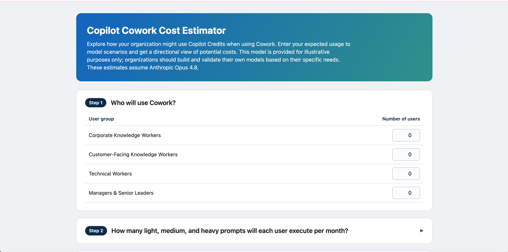

2.  If any fields already contain numbers, click “Reset to defaults”
    (bottom of the page) so everyone starts from the same place.  
    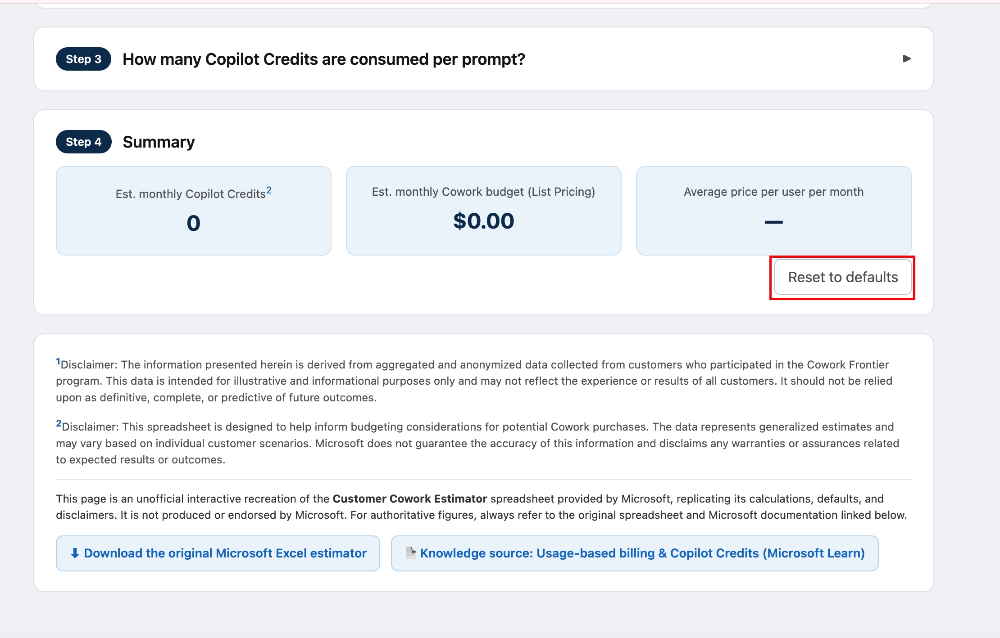

3.  In Step 1, enter 100 in “Corporate Knowledge Workers.” Leave the
    other three groups blank for now.  
    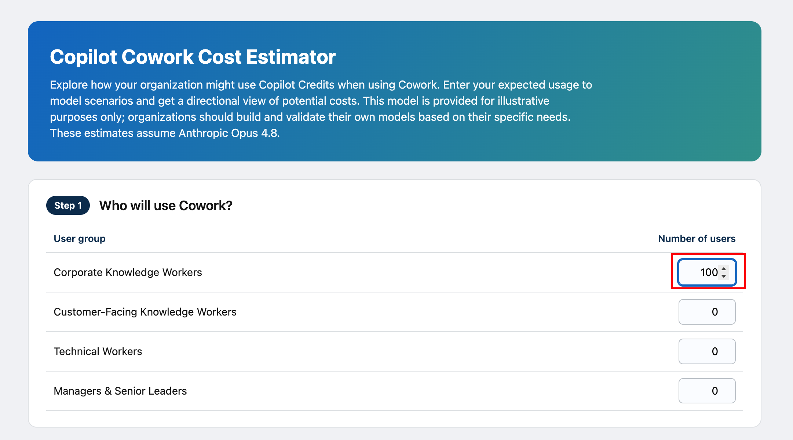

Leave Step 2 and Step 3 at their default values — do not change anything
yet.

4.  Scroll to Step 4 (Summary) and read the three results: estimated
    monthly Copilot Credits, estimated monthly Cowork budget (in
    dollars), and average price per user per month.  
    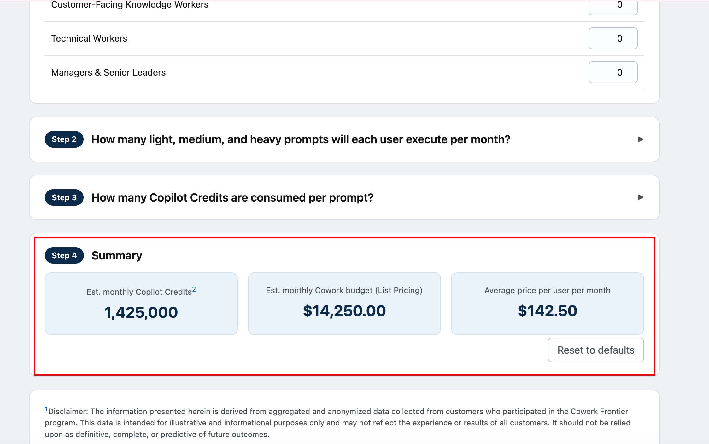

## Exercise 2 — The Prompt Mix Changes Everything

Goal: see first-hand why heavy prompts dominate cost. Keep 100 Corporate
Knowledge Workers from Exercise 1.

1.  Expand Step 2 (click the small ▶ arrow) so you can edit the light /
    medium / heavy prompt counts for Corporate Knowledge Workers.

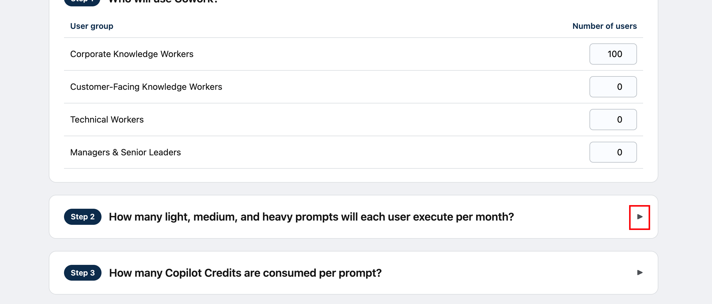

2.  Note the current defaults, then increase the number of heavy prompts
    per user by 5. Watch the Step 4 budget.  
    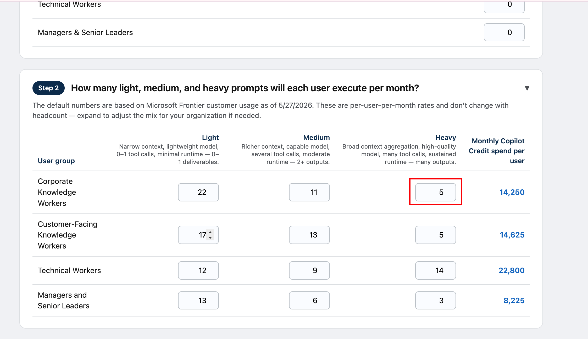

3.  Now set heavy prompts back to the default, and instead increase the
    light prompts by 5 i.e. to 27. Compare the budget
    change.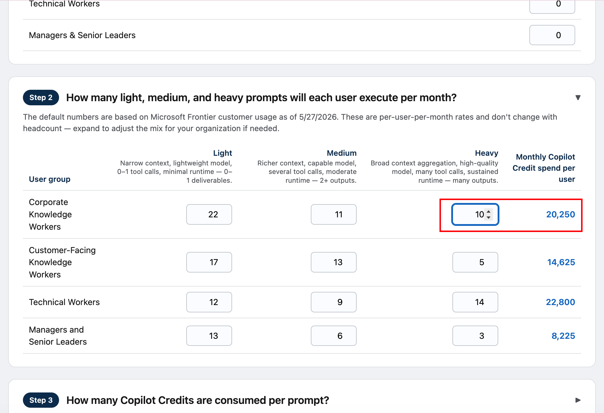

4.  Review the change in summary:  
    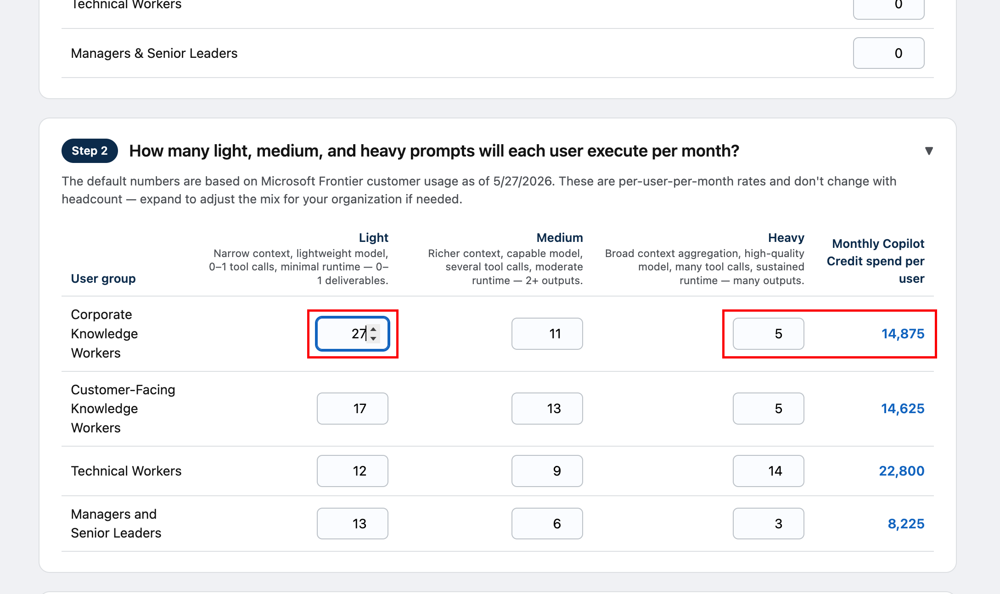

What you should notice

Adding heavy prompts raises the budget far more than adding the same
number of light prompts. This is the single most important budgeting
lesson: managing the mix of task intensity matters more than counting
total prompts. A team that runs a few very heavy Cowork research jobs
can cost more than a larger team running many light ones.

## Exercise 3 — A Realistic Four-Group Rollout

1.  Enter the four headcounts in Step 1 (use the sample numbers or your
    own).

[TABLE]

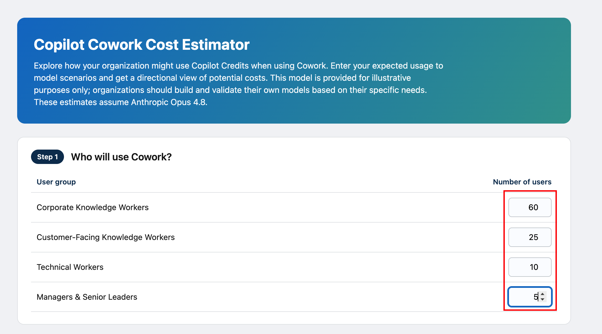

2.  Read the Step 4 summary and record the monthly budget and the
    average price per user.  
    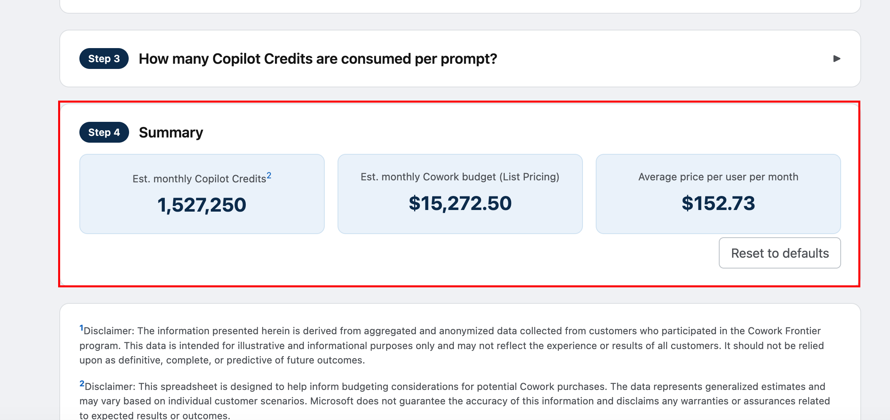

# **Exercise 4 — Tuning the Credit Assumptions**

1.  Expand Step 3. Note the default credits for light, medium, and heavy
    prompts.  
    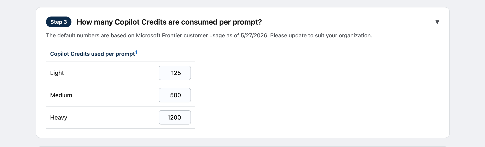

2.  Increase the heavy value by 100 to simulate more demanding tasks
    (for example, longer research runs). Observe the Step 4 budget.  
    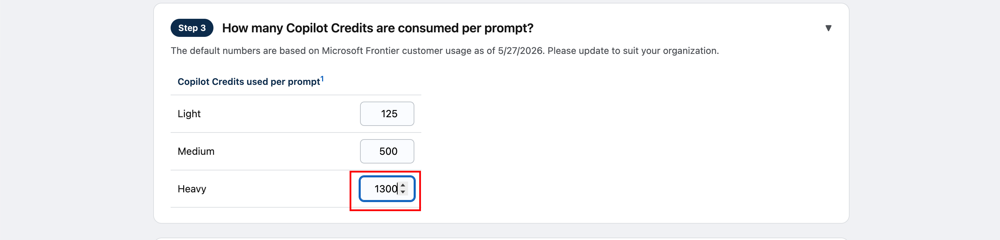

3.  Return it to the default using your notes (or “Reset to defaults” if
    needed, then re-enter your headcounts).  
    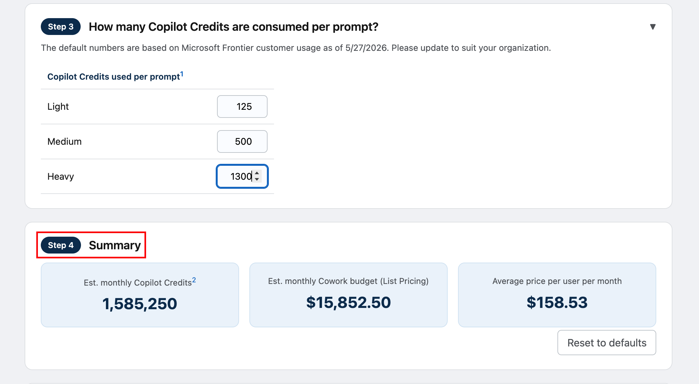

## Lab Summary

This lab walks you through estimating the cost of deploying Microsoft
Copilot Cowork using an online tool at coworkestimator.com. You start by
building a baseline estimate using 100 Corporate Knowledge Workers under
default settings, then move into testing how the mix of light, medium,
and heavy prompts affects the budget — discovering that adding just a
few heavy prompts raises costs far more than adding many light ones.
From there, you build a more realistic estimate across all four user
groups (Corporate Knowledge Workers, Customer-Facing Knowledge Workers,
Technical Workers, and Managers & Senior Leaders) using sample or your
own organization's headcounts, and observe how a small group of heavier
users, like senior leaders, can meaningfully shift the average cost per
user.

The final exercise has you adjust the underlying "credits per prompt"
assumptions in Step 3 to see how sensitive the overall budget is to
those inputs, reinforcing that these values carry the most uncertainty
in any estimate. Throughout, the lab stresses that the tool is
directional rather than a bill, is an unofficial recreation of
Microsoft's official estimator, and uses defaults that reflect Frontier
customer usage as of 27 May 2026 and assume Cowork runs on Claude Opus
4.8 — all of which should be validated against real usage data and
Microsoft's authoritative sources once available. The lab wraps up by
connecting these estimates to real-world governance practices, such as
using the Microsoft 365 admin center's Cost Management dashboard to
track actual spend, and asks you to produce a one-page deliverable
summarizing your pilot estimate along with the assumption you're least
confident in.
